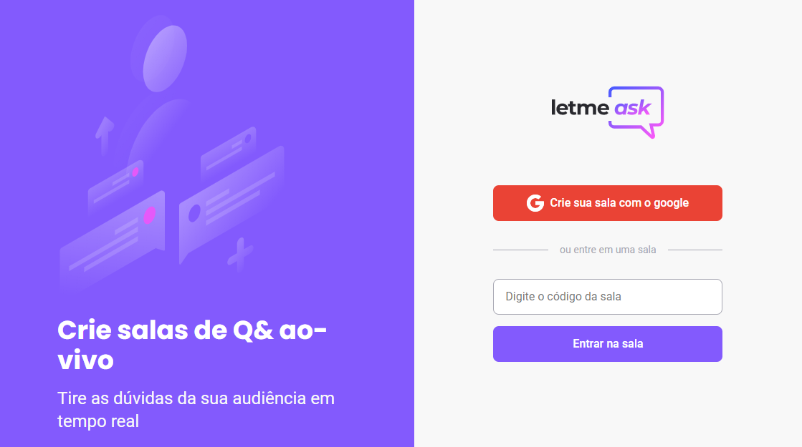

<h1 align="center">
    
</h1>

<p align="center">
  <a href="#-sobre">Sobre</a>&nbsp;&nbsp;&nbsp;|&nbsp;&nbsp;&nbsp;
  <a href="#-tecnologias">Tecnologias</a>&nbsp;&nbsp;&nbsp;|&nbsp;&nbsp;&nbsp;
  <a href="#-layout">Layout</a>&nbsp;&nbsp;&nbsp;|&nbsp;&nbsp;&nbsp;
  <a href="#-como-executar-o-projeto">Como executar</a>&nbsp;&nbsp;&nbsp;|&nbsp;&nbsp;&nbsp;
  <a href="#-licença">Licença</a>
</p>

<p align="center">
  

  
	
  <a href="https://github.com/pedromiiguel/Ecoleta/commits/master">
    
  </a>
   <a href="https://github.com/pedromiiguel/Letmeask/blob/main/LICENSE">
  
  </a>

   <a href="https://github.com/pedromiiguel/Letmeask/stargazers">
    
  </a>
</p>

<br/>

<h1 align="center">
     
</h1>

## 🔖 Sobre

Desenvolvido durante a Next Level Week Together da Rocketseat, o Letmeask é uma aplicação para criação de salas, onde o criador pode interir com seu público, respondendo suas dúvidas e destacando dúvidas mais relevantes.

## 🚀 Tecnologias

Tecnologias utilizazadas no projeto:

- [React](https://reactjs.org/)
- [Firebase](https://firebase.google.com/)
- [Typescript](https://www.typescriptlang.org/)
- [SASS](https://sass-lang.com/)
- [HTML](https://developer.mozilla.org/pt-BR/docs/Web/HTML)
- [CSS](https://developer.mozilla.org/pt-BR/docs/Web/CSS)

## 🛠 Layout

O layout da aplicação está disponível no [Figma](<https://www.figma.com/file/xx4WphYhSfBgmFoMWniOYb/Letmeask-(Copy)>). Para poder utilizá-lo é necessário uma conta no Figma.

## 🔧 Como executar o projeto

### Pré-requisitos

<p> É necessário possuir o Node.js instalado na máquina </p>
<p>E também possuir um gerenciador de tarefas NPM ou Yarn.</p>

```bash
# Clone este repositório
$ git clone https://github.com/pedromiiguel/Letmeask.git

# Acesse a pasta do projeto no terminal/cmd
$ cd letmeask

# Instale as dependências
$ npm install ou yarn 

# Execute a aplicação em modo de desenvolvimento
$ npm start ou yarn start

# O servidor inciará na porta:3000 - acesse http://localhost:3000
```

## 📝 Licença

Esse projeto está sob a licença MIT.

## :man_astronaut: Autor

#### Pedro Miguel

- Git Hub: <a href="https://github.com/pedromiiguel" target='_blanck' >@pedromiiguel</a>
- Linkedin: <a href="https://www.linkedin.com/in/pedro-miiguel" target='_blanck' >@pedromiiguel</a>
